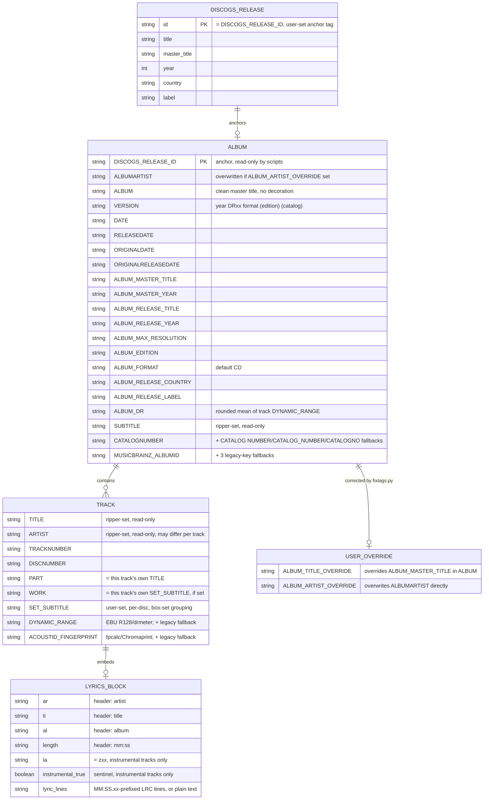

# FLAC Tag Schema — ERD

A visual companion to [ADR 0002](adr/0002-flac-tag-handling.md) (the FLAC tag handling
contract) and [ADR 0008](adr/0008-roon-specific-tag-conventions.md) (Roon-specific tags).
Those documents are authoritative — this diagram is a derived reference, not a replacement.

Modeled as: `DISCOGS_RELEASE` anchors one `ALBUM` (via `DISCOGS_RELEASE_ID`), which contains
many `TRACK`s and may be corrected by a `USER_OVERRIDE`; each `TRACK` optionally embeds a
`LYRICS_BLOCK`. `ALBUM`-level tags are written uniformly across the directory by `fixtags.py`;
`PART`/`WORK`/`DYNAMIC_RANGE`/`ACOUSTID_FINGERPRINT`/`LYRICS` are genuinely per-track.
